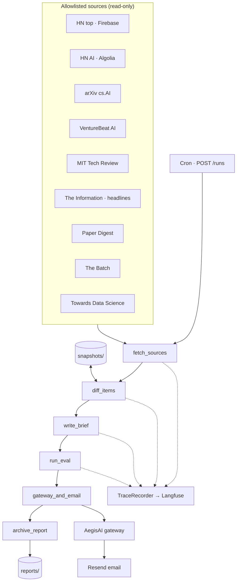

# Sentinel Brief


<!-- vpeetla-tech-stack:start -->
[]() []() []() []() []() []() []() []()
<!-- vpeetla-tech-stack:end -->
[](https://github.com/vpeetla-ai/sentinel-brief/actions/workflows/ci.yml)
[](https://sentinel-brief-ruddy.vercel.app)
[](https://sentinel-brief-api.onrender.com/health)

**Governed overnight AI intelligence reporter** — nine allowlisted sources → snapshot diff → executive brief → eval gate → gateway email → archived reports.

[▶ Live demo](https://sentinel-brief-ruddy.vercel.app) · [API health](https://sentinel-brief-api.onrender.com/health) · [Case study](https://github.com/vpeetla-ai/ai-architecture-portfolio/blob/main/case-studies/sentinel-brief.md) · [Deploy](docs/DEPLOY.md)

---

## What this is

A **daily executive brief** for principal AI architects: Hacker News, arXiv cs.AI, industry press, and newsletters — scanned overnight, summarized, and emailed to your inbox with a full audit trail.

Part of the [vpeetla-ai](https://github.com/vpeetla-ai) governed agent portfolio (repo #17).

## How we solve it

| Problem | Approach |
|---------|----------|
| Nine tabs every morning | Allowlisted RSS/API adapters in `config/sources.yaml` |
| Noise vs signal | Per-source JSON snapshots — only **deltas** enter the brief |
| Uncontrolled autonomy | **Eval gate** before send; **AegisAI gateway** on `email.send` only |
| No audit trail | Every run archived — `GET /reports`, demo UI viewer |

**Governance boundary:** fetch, diff, summarize, and eval run autonomously. Email is the only irreversible side effect.

## Architecture

Canonical: [`docs/diagrams/canonical-architecture.mmd`](docs/diagrams/canonical-architecture.mmd)



## Case study & tradeoffs

| Doc | Link |
|-----|------|
| **Case study** | [sentinel-brief.md](https://github.com/vpeetla-ai/ai-architecture-portfolio/blob/main/case-studies/sentinel-brief.md) |
| **Architecture** | [docs/ARCHITECTURE.md](docs/ARCHITECTURE.md) |
| **Product & tradeoffs** | [docs/PRODUCT.md](docs/PRODUCT.md) |
| **ADR — governed overnight brief** | [docs/adr/0001-governed-overnight-brief.md](docs/adr/0001-governed-overnight-brief.md) |
| **LOOPS harness** | [docs/LOOPS.md](docs/LOOPS.md) |

## Status

| Area | Status | Notes |
|------|--------|-------|
| Source adapters (9 allowlisted) | ✅ | RSS/API first; paywalled = headline only |
| LangGraph pipeline | ✅ | fetch → diff → brief → eval → email → archive |
| Eval gate | ✅ | Min deltas, citations, structure |
| Resend email | ✅ | Live — `vpeetla.ai@gmail.com` |
| Render API | ✅ | [sentinel-brief-api.onrender.com](https://sentinel-brief-api.onrender.com) |
| Vercel demo UI | ✅ | [sentinel-brief-ruddy.vercel.app](https://sentinel-brief-ruddy.vercel.app) — three-column glass-box |
| Glass-box workbench UX | ✅ | arch/SLOs · LangGraph phase replay (`phases` / TraceRecorder `duration_ms`) · run & reports |
| Nightly cron | ✅ | Workflow shipped (`.github/workflows/nightly.yml`); requires `SENTINEL_API_URL` secret to hit live API |
| Golden eval suite | ✅ | `sentinel_brief_gate_v1` in golden-eval-registry |
| Trace-linked observability | ✅ | `app.vpeetla_observability` — system/trace/node spans |
| Langfuse export | ✅ | Set `LANGFUSE_*` in Render — see [DEPLOY.md](docs/DEPLOY.md) |
| LLM synthesis | ✅ | Prefer `LLM_GATEWAY_URL` → [aegis-llm-gateway](https://github.com/vpeetla-ai/aegis-llm-gateway); else Groq/OpenAI; template fallback |
| API-key gate on `POST /runs` | ✅ | Set `SENTINEL_API_KEY` on Render — see [ADR-0002](docs/adr/0002-runs-auth-and-llm-synthesis.md) |
| Persistent report disk | 🟡 | Live runs write `data/reports/` (ephemeral on Render). **Durable demo:** committed `archives/` merged into `GET /reports` so the UI is never empty after redeploy (P3.1). |
| Playwright scrape | ⬜ | Deferred per ADR-0001 |

---

## Quick start

```bash
git clone https://github.com/vpeetla-ai/sentinel-brief.git
cd sentinel-brief
pip install -e ".[dev]"
pytest -q
uvicorn app.main:app --reload --app-dir backend
curl -X POST http://localhost:8000/runs
```

Env template: [`.env.example`](.env.example) · Production: [docs/DEPLOY.md](docs/DEPLOY.md)

## Sources (allowlisted)

| Source | Adapter |
|--------|---------|
| Hacker News (top) | Firebase API |
| HN AI front page | Algolia HN search |
| arXiv cs.AI | Atom API |
| VentureBeat AI · MIT TR · Batch · TDS · Paper Digest | RSS |
| The Information | RSS partial (headlines only) |

Configure in [`config/sources.yaml`](config/sources.yaml).

## Interview map

**Business function:** Overnight intelligence brief — allowlisted sources → diff → summary → eval → governed email.

Staff+ prep crosswalk — [playbook](https://github.com/vpeetla-ai/ai-architect-interview-playbook) · [study UI](https://ai-architect-interview-playbook.vercel.app) · [Practice Arena](https://ai-architect-practice-arena.vercel.app) · [org matrix](https://github.com/vpeetla-ai/ai-architecture-portfolio/blob/main/docs/REPO_INTERVIEW_MAP.md). Only entries this repo honestly exercises.

| Category | Entry | Fit |
|----------|-------|-----|
| System design | [Agent orchestration](https://ai-architect-interview-playbook.vercel.app/q/ai-system-design/03-agent-tool-use-orchestration-platform/) ([md](https://github.com/vpeetla-ai/ai-architect-interview-playbook/blob/main/ai-system-design/03-agent-tool-use-orchestration-platform.md)) | LangGraph run with gateway on email.send only |
| Cloud | [LLM gateway / model routing](https://ai-architect-interview-playbook.vercel.app/q/cloud-architecture/07-llm-gateway-semantic-cache-model-router/) ([md](https://github.com/vpeetla-ai/ai-architect-interview-playbook/blob/main/cloud-architecture/07-llm-gateway-semantic-cache-model-router.md)) | `LLM_GATEWAY_URL` → aegis-llm-gateway; email still via AegisAI |
| General SD | [Job scheduler / task queue](https://ai-architect-interview-playbook.vercel.app/q/general-system-design/04-distributed-job-scheduler-task-queue/) ([md](https://github.com/vpeetla-ai/ai-architect-interview-playbook/blob/main/general-system-design/04-distributed-job-scheduler-task-queue.md)) | Scheduled overnight runs |
| General SD | [Notification system](https://ai-architect-interview-playbook.vercel.app/q/general-system-design/08-notification-system/) ([md](https://github.com/vpeetla-ai/ai-architect-interview-playbook/blob/main/general-system-design/08-notification-system.md)) | Email as irreversible notify path |
| General SD | [Web crawler](https://ai-architect-interview-playbook.vercel.app/q/general-system-design/11-web-crawler/) ([md](https://github.com/vpeetla-ai/ai-architect-interview-playbook/blob/main/general-system-design/11-web-crawler.md)) | Partial — allowlisted RSS/API fetch, not open crawl |

## Stack fit

| Layer | Integration |
|-------|-------------|
| Orchestration | LangGraph `StateGraph` |
| Completions | Optional `LLM_GATEWAY_URL` → aegis-llm-gateway (email path unchanged) |
| Governance | AegisAI gateway on `email.send` |
| Evaluation | In-repo eval + [golden-eval-registry](https://github.com/vpeetla-ai/golden-eval-registry) |
| Observability | Trace-linked spans + optional Langfuse — [ARCHITECTURE](docs/ARCHITECTURE.md#observability) |
| Deploy | Render API + Vercel demo |
