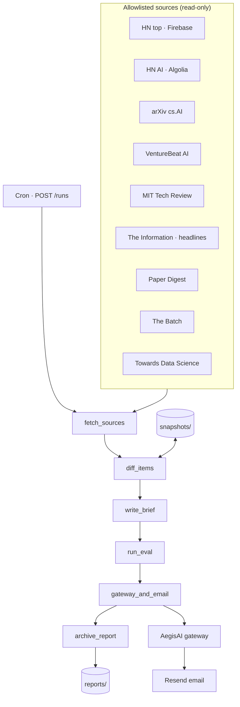

# Sentinel Brief

[](https://github.com/vpeetla-ai/sentinel-brief/actions/workflows/ci.yml)

**Governed overnight AI intelligence reporter** — allowlisted sources → snapshot diff → executive brief → eval gate → gateway-authorized email → archived reports.

## Problem

Staying current on AI research, industry news, and community signal across nine+ sources is manual and noisy. You want a **daily executive brief** that runs while you sleep — but **email is a side effect** and must stay governed.

## Architecture (60s)

Canonical diagram: [`docs/diagrams/canonical-architecture.mmd`](docs/diagrams/canonical-architecture.mmd)



**Read path:** sources → fetch → diff (vs snapshots) → brief → eval → gateway → email → archive.

**Governance boundary:** only `gateway_and_email` sends mail; everything before it is autonomous.

## Status

| Area | Status | Notes |
|------|--------|-------|
| Source adapters (9 allowlisted) | ✅ MVP | RSS/API first; paywalled = headline only |
| Snapshot + delta detection | ✅ | JSON per source |
| LangGraph pipeline | ✅ | fetch → diff → summarize → eval → email → archive |
| Eval gate | ✅ | Min deltas, citations, structure |
| AegisAI gateway on email | ✅ | Fail-open dev / fail-closed prod |
| Resend email | ✅ | Dry-run without keys |
| FastAPI + report archive | ✅ | `GET /reports`, `GET /reports/{id}` |
| Demo UI | ✅ | Static `demo/` — architecture + report viewer |
| Render deploy | 🟡 | [DEPLOY.md](docs/DEPLOY.md) — Blueprint + Resend + `SENTINEL_API_URL` cron secret |
| LLM summarization | 🟡 | Template brief MVP; LLM hook planned |
| Playwright scrape | ⬜ | Deferred — RSS/API per ADR-0001 |

## Quick start

```bash
cd sentinel-brief
pip install -e ".[dev]"
pytest -q
uvicorn app.main:app --reload --app-dir backend
# Trigger a run
curl -X POST http://localhost:8000/runs
```

Env (optional):

```bash
BRIEF_RECIPIENT_EMAIL=you@example.com
RESEND_API_KEY=re_...
AEGISAI_API_BASE_URL=https://your-aegis-api
AEGISAI_GATEWAY_ENABLED=true
```

## Sources (allowlisted)

| Source | Adapter | Access |
|--------|---------|--------|
| Hacker News (top) | Firebase API | Public |
| HN AI front page | Algolia HN search | Public |
| arXiv cs.AI | Atom API | Public |
| VentureBeat AI | RSS | Public |
| MIT Technology Review | RSS | Public |
| The Information | RSS partial | Paywalled headlines |
| Paper Digest | RSS | Public |
| The Batch (DeepLearning.AI) | RSS | Public |
| Towards Data Science | Medium RSS | Public (ToS) |

Configure in [`config/sources.yaml`](config/sources.yaml).

## Docs

- [Architecture](docs/ARCHITECTURE.md) — layers, decisions, tradeoffs
- [Product](docs/PRODUCT.md) — who, jobs-to-be-done, roadmap
- [ADR-0001](docs/adr/0001-governed-overnight-brief.md) — governed autonomy pattern
- [LOOPS](docs/LOOPS.md) — overnight harness alignment

## Stack fit (vpeetla-ai)

| Layer | Integration |
|-------|-------------|
| Orchestration | LangGraph `StateGraph` |
| Governance | AegisAI gateway on `email.send` |
| Evaluation | In-repo eval gate + [golden-eval-registry](https://github.com/vpeetla-ai/golden-eval-registry) `sentinel_brief_gate_v1` |
| Observability | Structured report JSON; Langfuse hook planned |
| Deploy | Render API + Vercel static demo — see [DEPLOY.md](docs/DEPLOY.md) |

Part of the [vpeetla-ai](https://github.com/vpeetla-ai) governed agent portfolio.
