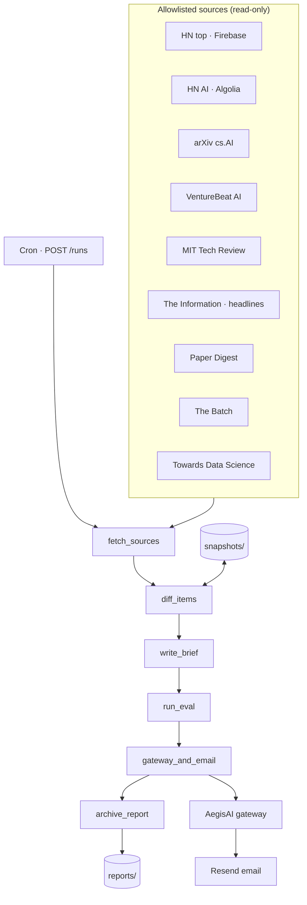
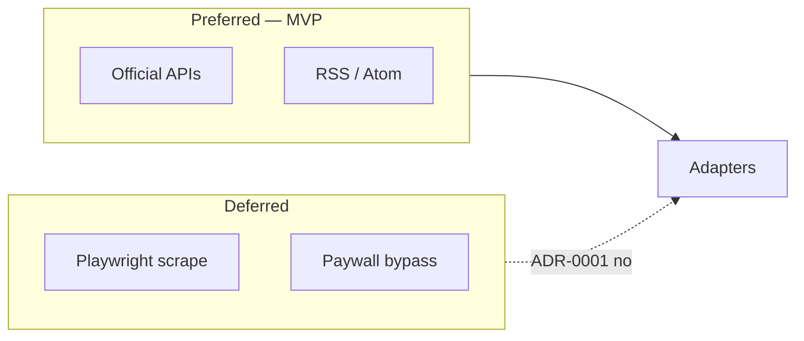
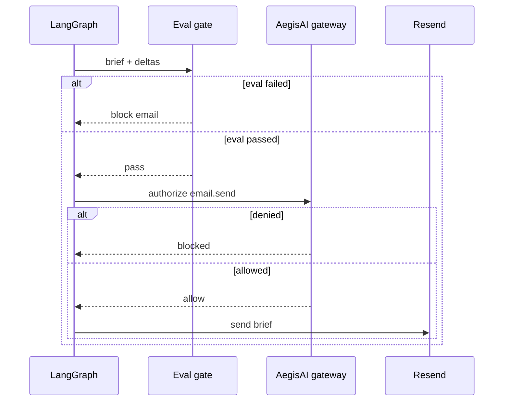

# Architecture — Sentinel Brief

## Who & what

**Customer:** Principal / staff AI architect who needs a daily signal scan without manual tab-hopping.

**System:** Overnight **governed intelligence reporter** that ingests allowlisted public sources, detects what's new since last run, produces an executive markdown brief, passes an eval gate, and sends email only through the AegisAI gateway.

## System diagram

Same as README — source of truth: [`diagrams/canonical-architecture.mmd`](diagrams/canonical-architecture.mmd)



## Layered view

```text
┌─────────────────────────────────────────────────────────────┐
│  Presentation — demo UI, email HTML, GET /reports           │
├─────────────────────────────────────────────────────────────┤
│  Orchestration — LangGraph: fetch→diff→brief→eval→email     │
├─────────────────────────────────────────────────────────────┤
│  Domain — RawItem, snapshots, deltas, BriefEvalResult       │
├─────────────────────────────────────────────────────────────┤
│  Integrations — RSS/Atom/HN APIs, Resend, AegisAI gateway   │
├─────────────────────────────────────────────────────────────┤
│  Config — sources.yaml allowlist, env secrets               │
└─────────────────────────────────────────────────────────────┘
```

## Pipeline (nodes)

| Node | Responsibility | Side effects |
|------|----------------|--------------|
| `fetch_sources` | Parallel adapter fetch | None (HTTP read) |
| `diff_items` | Compare fingerprints vs snapshot store | Writes snapshots |
| `write_brief` | Markdown executive brief | None |
| `run_eval` | Structure, citations, min-delta check | None |
| `gateway_and_email` | AegisAI authorize → Resend | **Email** |
| `archive_report` | JSON report artifact | Writes reports |

**Only irreversible side effect:** email send (after eval pass + gateway allow).

## Source adapter strategy



| Source | Mechanism | Rationale |
|--------|-----------|-----------|
| HN top | Firebase JSON API | Stable, ToS-friendly |
| HN AI | Algolia search API | Filters AI signal without scraping |
| arXiv cs.AI | Atom export API | Canonical, no scrape |
| VentureBeat, MIT TR, Batch, TDS, Paper Digest | RSS | Low fragility |
| The Information | RSS partial | Honest headline-only; no paywall bypass |

## Governance model



- **Eval gate (inner loop):** autonomous — no human per run
- **Gateway (outer loop):** policy on email; HITL when gateway returns `pending_approval`
- **Fail-open vs fail-closed:** `AEGISAI_GATEWAY_FAIL_OPEN=true` in dev; `false` in prod

## Key decisions

| ID | Decision | Alternatives considered |
|----|----------|-------------------------|
| D1 | LangGraph linear pipeline | Celery tasks, cron shell script |
| D2 | JSON snapshot store | SQLite, Redis — chose JSON for MVP portability |
| D3 | LLM executive summary (Groq/OpenAI), template fallback | LLM-only — rejected, would break on missing key/outage instead of degrading |
| D4 | RSS/API only | Playwright — rejected for fragility + ToS |
| D5 | Single recipient email | Slack digest — future |
| D6 | Gateway on email only | Gateway on fetch — rejected (read-only) |
| D7 | API-key gate on `POST /runs` only | Gating `/reports` too — rejected, archive is meant to be publicly browsable (portfolio demo) |

## Tradeoffs

| Choice | Upside | Downside |
|--------|--------|----------|
| Autonomous inner loop | Runs overnight without you | Bad brief possible if eval too weak |
| Eval before email | Blocks low-quality sends | May skip useful quiet days (min_delta) |
| RSS over scrape | Stable, fast, legal | Misses layout-only sites, paywalled bodies |
| LLM brief with template fallback | Real synthesis when configured, never hard-fails | Slightly higher latency/cost when a key is set |
| Per-source snapshots | Simple diff | No cross-source dedup yet |
| Fail-open gateway (dev) | Local iteration | Must disable in prod |
| `SENTINEL_API_KEY` unset = open | Dev/demo works without setup | Must be set before treating a deployment as production (see ADR-0002) |

## Data flow

```text
sources.yaml → adapters → RawItem[]
                ↓
         snapshot diff → delta RawItem[]
                ↓
         summarize_brief → markdown
                ↓
         evaluate_brief → pass/fail
                ↓
    gateway authorize → email (if pass)
                ↓
         data/reports/{run_id}.json
```

## Deployment

| Component | Target |
|-----------|--------|
| API | Render (`render.yaml`) |
| Demo UI | Vercel static (`demo/`) |
| Cron | Render cron job → `POST /runs` or GitHub Actions schedule |
| Secrets | `RESEND_API_KEY`, `BRIEF_RECIPIENT_EMAIL`, AegisAI URL, `LANGFUSE_*` (optional) |

## Observability

Trace-linked spans via `backend/app/vpeetla_observability/` — same three-level model as the org spec ([TRACE_LINKED_OBSERVABILITY](https://github.com/vpeetla-ai/ai-architecture-portfolio/blob/main/docs/TRACE_LINKED_OBSERVABILITY.md)).

| Signal | Where |
|--------|-------|
| Request trace ID | `TraceRequestMiddleware` on FastAPI |
| Run recorder | `TraceRecorder` in `brief_runner.py` |
| Graph node spans | `@observe_node` on fetch, diff, brief, eval, email |
| Eval scores | `eval.brief_gate` attached before send |
| Langfuse export | `LANGFUSE_PUBLIC_KEY` + `LANGFUSE_SECRET_KEY` |

## Future (honest backlog)

1. LLM executive synthesis (LiteLLM) with citation grounding
2. Cross-source dedup (URL normalization, title fuzzy match)
3. golden-eval-registry suite: `sentinel-brief-quality`
4. Slack/Telegram via same gateway pattern

## Related ADRs

- [ADR-0001: Governed overnight brief](adr/0001-governed-overnight-brief.md)
